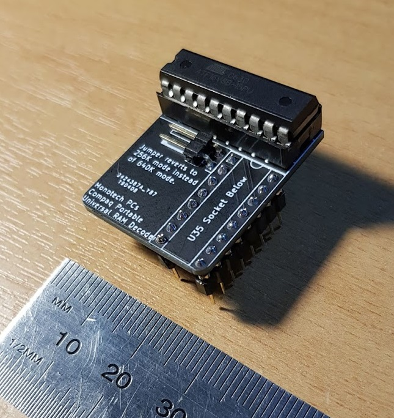
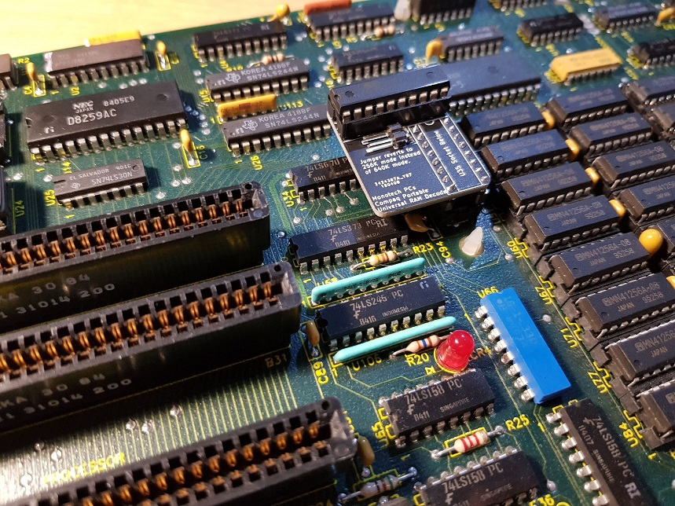

# Compaq Portable RAM Decoder PROM (U35)
SPLD-based replacement of RAM decoder PROM in Compaq Portable, allowing either 256K or 640K RAM on the system board.

This goes into socket U35 on the original Compaq Portable motherboard.

This isn't for later model Compaq Portable motherboards, which use jumpers instead and don't need a PROM replaced to upgrade onboard RAM.

If you'd like to have 256K RAM onboard and you don't own a 256K U35 (PN 100340-001 (some PROMs only have the PROM model enscribed)), you can install this and close the jumper to put it into 256K mode. Then ensure the two socketed DRAM banks contain 64Kx1 ICs (256Kx1 ICs should work just fine too).

If you'd like to have 640K RAM onboard and you don't own a 640K U35 (PN 101257-001 (some PROMs only have the PROM model enscribed)), you can install this and remove the jumper to put it into 640K mode. Then ensure the two socketed DRAM banks contain 256Kx1 ICs.

# Why?
Compaq officially supported three different RAM configs in the Compaq Portable: 256K, 448K, and 640K. Changing the config meant installing different amounts of 64Kx1 and 256Kx1 DRAM ICs, as well as swapping the 82S123-type bipolar PROM (U35) with one for that specific config. Compaq sold these PROMs, and I don't think they've all been dumped. At the time of designing this, I only had the 256K PROM, but after dumping it, it wasn't difficult to work out how the 640K one would work.

This is useful because it can save you an ISA slot, since you no longer need to use one up to get 640K RAM.

I did experiment trying to install a third bank of 256K, and using some as UMB, but it seemed to 'almost' work, but was unstable. It was a few years ago so I don't remember the exact details.

If this page is still up, then I should have stock if you'd just like to buy one instead - I have the DRAM ICs too: https://monotech.fwscart.com/Compaq_Portable_640K_U35_RAM_Decoder_PROM/p6083514_19805777.aspx

# License
Creative Commons CC BY-SA 4.0: https://creativecommons.org/licenses/by-sa/4.0/.
